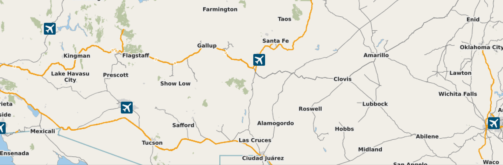

TripLog

A Java program that analyzes trip data stored in a CSV file. It includes classes and methods to read trip data, perform stop detection using two different heuristics, calculate various trip statistics, and visualize the trip on a map using JMapViewer.

The TripPoint class represents a point in a trip and contains attributes for time, latitude, and longitude. It also includes methods for distance calculation, speed calculation, and other trip-related calculations.

The Driver class is the main class that includes the main method. It sets up a graphical user interface (GUI) using Swing components and JMapViewer to display the trip data and provide interactive functionalities. It allows the user to play an animation of the trip, toggle the visibility of stops, and select the animation time duration.

